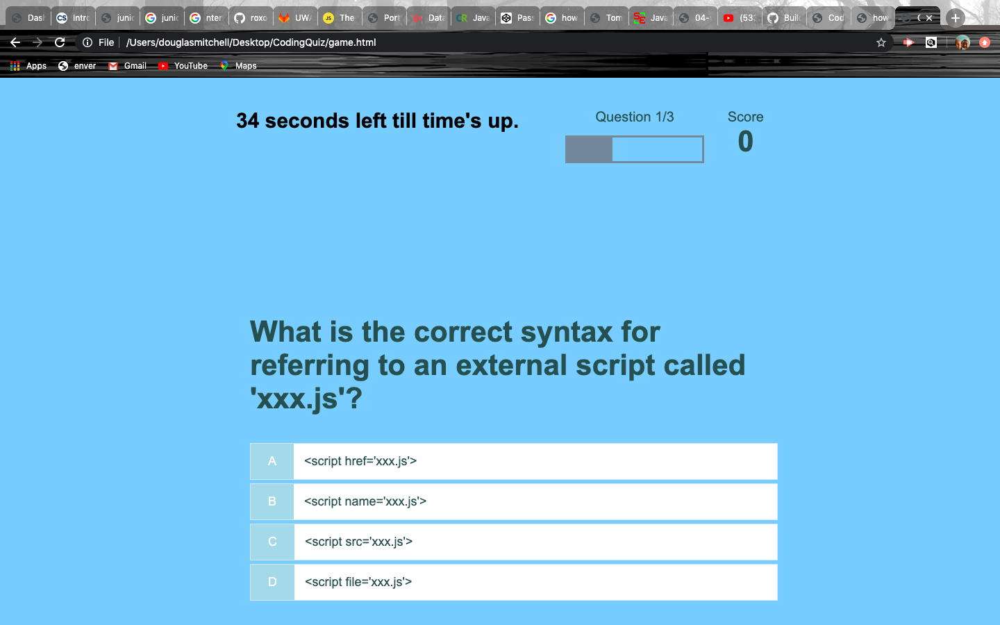

# CodingQuiz

In this project, I built a timed quiz with 3 consecutive coding questions. If one question is answered wrong, the timer loses 10 seconds. When the timer reaches 0 or all 3 questions are answered, the quiz is over and the player can save his/her name and score to the highscores list in local storage.

https://roxonus.github.io/CodingQuiz/.

